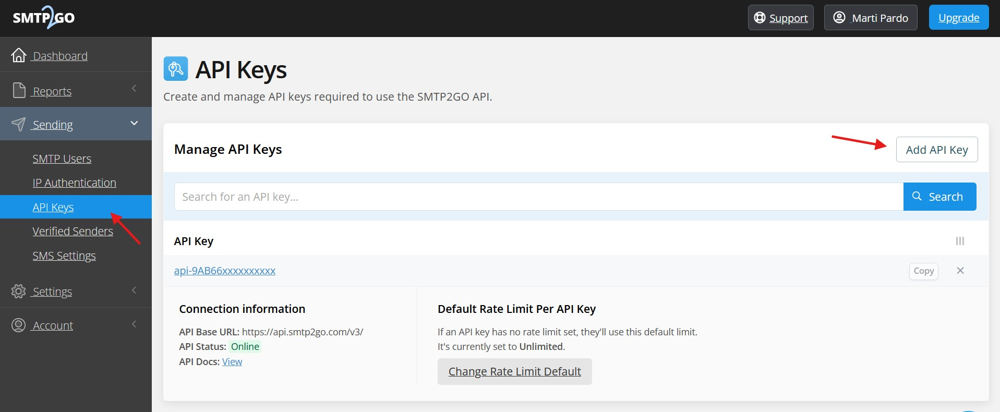
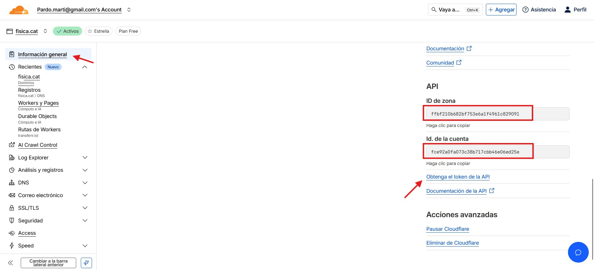
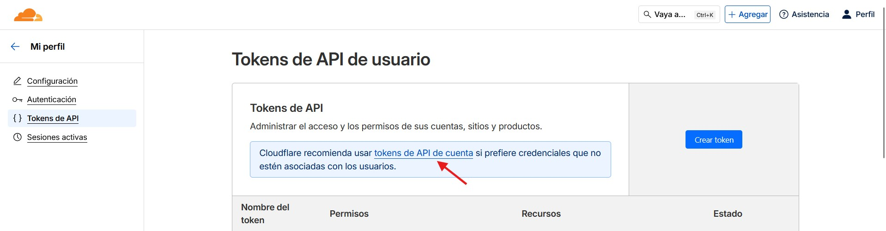
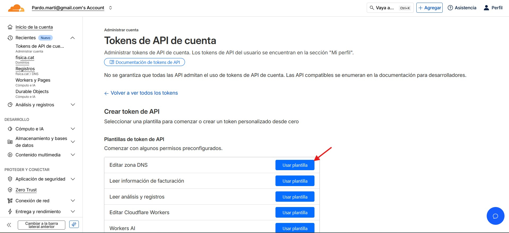
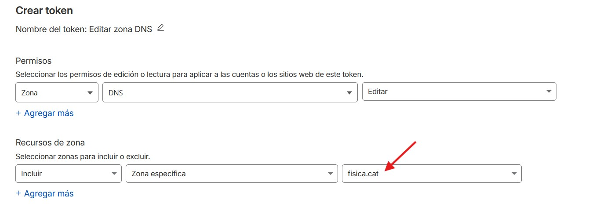

## Previous: Domain setup guide
#### 1. Managing your domain
Before anything you'll need to change your domain nameservers to Cloudflare so you can manage DNS from there. That is done by first adding your domain in Cloudflare, copying the given nameservers and using them in your registar's dashboard (where you purchased your domain i.e. Spaceship, Namecheap, Porkbun, GoDaddy, etc.). Nameservers can take up to 24 hours to propagate (normal DNS are much faster but nameservers are slow).

Once you can manage your domain's DNS you'll want probably to link the apex (root) domain to some website you already have (on GitHub Pages, Vercel, etc.). And maybe even link more websites to subdomains. Once happy, let's proceed with email.
#### 2. Setting up ForwardEmail
ForwardEmail has a generous free tier that allows us the main 2 things we're interested in:
- Forwarding incoming emails to personal inboxes (like Gmail, Outlook, etc.) so that we don't miss any mail (this website has no desktop app nor mobile app and therefore no push notifications).
- Sending incoming emails content to a webhook so we can store those emails on a database (and display them in our Web Application).

To set up ForwardEmail we go to their [site](https://forwardemail.net/en/my-account/domains) and add our domain, choose the Free Tier and verify the domain by adding two MX records (to `mx1.forwardemail.net` and `mx2.forwardemail.net`). Once verified we can start forwarding emails.

In the Free Tier the only way to forward emails is via DNS. Common use cases are explained in their [FAQs](https://forwardemail.net/en/faq#how-do-i-get-started-and-set-up-email-forwarding).

One thing we'll want to setup is an admin alias that forwards to one of your personal addresses (probably Gmail). That is done via a single DNS record:

|  Type  | Name/Host | Value   | TTL  |
|-----------------|-------|---------------|-------------|
| TXT  | @ | "forward-email=admin:pardo.marti@gmail.com"  |   3600     |

Now you can use admin@example.com (or whatever you domain is) to register in different apps.

#### 3. Setting up SMTP2GO
SMTP2GO is the email sender, the one that will send emails for you via API. To not loose track of things we can sign up in SMTP2GO using precisely admin@example.com.

Then we'll have to add a set of DNS records to verify our mail.

Once verified, we obtain an API key (in Sending > API Keys) and use it as environment variable (both in `.env.local` and Vercel).

#### Extra: Setting up Mailgun
If you wanna use SMTP2GO for your apex domain, you don't want it mixed up with mails you'll send as automatons (for example mails sent via SMTP in popular services like NextCloud, Immich, etc.). 

So you need to clearly separate between automated emails (on some subdomain) and manual emails (which you can keep on apex domain) that is to avoid your automated emails reputation impact your manual emails reputation (all domains and email servers have a constantly being evaluated reputation). One of the best services for doing that is Mailgun (emails will be sent from alias@mg.yoursite.com instead of alias@yoursite.com).

You'll only need two TXT records to verify your domain for mailgun. You can learn how to set up Mailgun for sending mails via API or via SMTP here: https://documentation.mailgun.com/docs/mailgun/user-manual/domains/domains-verify

## Cloudflare setup guide

Okay, now our mail DNS setup is finished. The only thing we need is to be able to add a new forwarding for each new registered user. To do so we'll need to be able to create and edit DNS of our site example.com, that is done via Cloudflare API.

First we'll go to our domain overview page and copy the Account ID and Zone (domain) ID and use them in our environment variables.

Then we'll go to "Obtain API Token" and click on Account API Tokens

Here we'll create a new token using the DNS Edit template

The only thing we'll have to do is select our domain (zone in which the API has permission to edit DNS) and  leave the rest as is.

Then we'll click the blue button to go to resume, and then click on "Create token". Once the API key is displayed we'll copy it and use it as our environment variable (both in `.env.local` and Vercel).