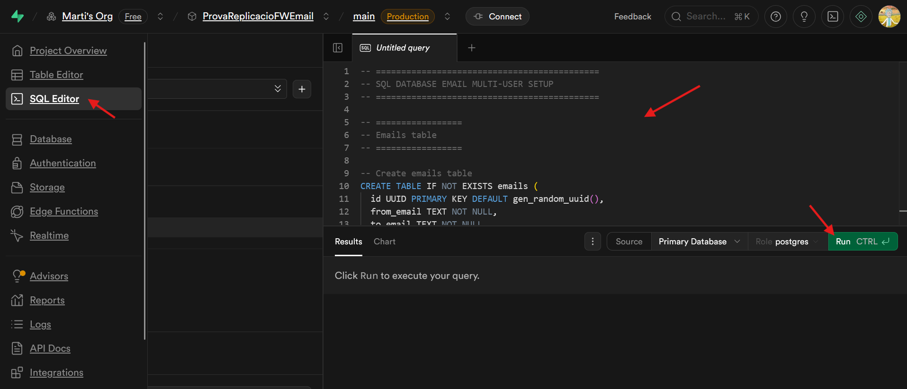
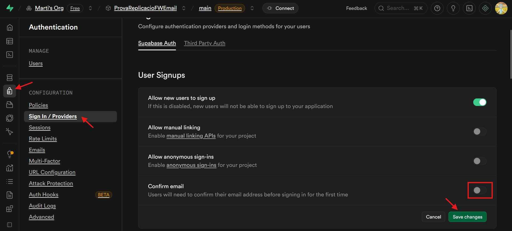

## Supabse setup guide
1. Log In or Sign Up at https://supabase.com
2. Create a new project
3. Open the SQL Editor, paste there the contents of [`./database-setup.sql`](./database-setup.sql) and then press Run.
  
4. Disable email confirmation (in Authentication > Sing In / Providers)
  
5. Copy project URL (from Project Settings > Data API) and paste it in a `.env.local` file (if developing locally) or in Project Settings > Environment Variables (in Vercel or any other production platform).
  
6. Copy public anon API key and service role API key (from Project Settings > API Keys) and set them as your environment variables (both in `.env.local` and Vercel)
  